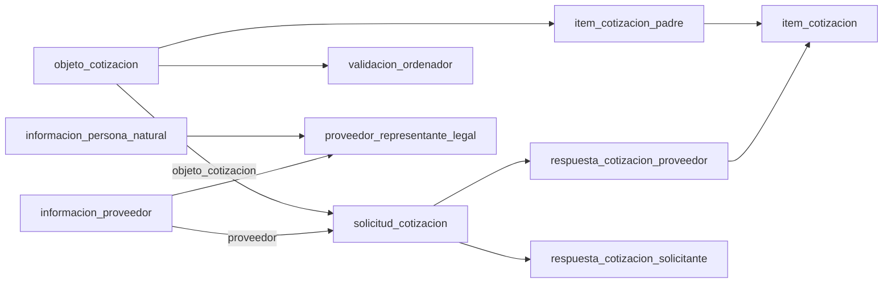

# Issue #18 — diagnóstico corregido de Agora y terceros

Fecha: 2026-09-27. Entorno: **pruebas**, confirmado por el responsable. Evidencia: capturas locales `AgoraFinal` y `Terceros`, contrastadas con [el análisis funcional de la issue #5](issue-5-roles-modulos-agora-v1.md). Los CSV, SQL y diagramas se conservan fuera de Git.

## Corrección del alcance anterior

El responsable confirmó que la primera captura correspondía a una base equivocada para este trabajo. Quedan sustituidas las conclusiones anteriores sobre 28 tablas `prov_*`, ausencia de tablas de negocio, falta de SELECT y predominio de logs. Tampoco se trasladan sus riesgos estructurales ni sus cifras al modelo actual. La evidencia vigente proviene de dos conexiones de **pruebas**, con acceso de lectura. No es una captura de producción.

`AgoraFinal` y `Terceros` son carpetas de evidencia, no nombres SQL de bases. La primera captura tiene esquema activo `agora`, la segunda `terceros`, en bases diferentes. Cada inventario incluye otros esquemas: se filtraron explícitamente `agora` y `terceros` para las cifras de este informe. Se omiten nombres de servidores, usuarios y bases ajenas al alcance.

## Inventario reproducible

Fuentes por carpeta: 1 contexto, 2 esquemas, 3 objetos/permisos/estimaciones, 4 columnas, 5 restricciones, 6 índices y 15 conteos de automatización. No contienen mediciones de calidad de las filas. El acceso de lectura se verifica en el resultado 3; la consulta 14 original filtra `public` y no verifica estos dos esquemas.

| Métrica del esquema seleccionado | agora | terceros |
|---|---:|---:|
| Tablas ordinarias | 46 | 13 |
| Secuencias | 33 | 13 |
| Columnas | 340 | 112 |
| PK | 45 | 13 |
| FK | 70 | 16 |
| UNIQUE adicionales | 5 | 0 |
| CHECK declarados | 14 | 0 |
| Índices | 71 | 13 |
| Tablas con SELECT | 46 | 13 |
| Tablas con RLS habilitado | 0 | 0 |
| Tablas con estimación de filas desconocida (-1) | 8 | 7 |
| Tamaño de tablas, índices y TOAST | 63,87 GiB | 245,52 MiB |

Las restricciones inventariadas figuran como validadas. No equivale a una auditoría de datos. `reltuples=-1` significa estimación desconocida, **no tabla vacía**. Las cifras de pruebas no permiten inferir volumen o calidad de producción.

`agora.objeto_cotizacion_forma_pago` es la única tabla del esquema sin PK; sus dos referencias permiten NULL. En terceros, todos los índices inventariados corresponden a PK: no hay unicidad declarada del par tipo+número de documento ni índices adicionales para las relaciones.

## Correspondencia con los flujos de la issue #5

La existencia y las FK de las tablas son evidencia estructural. Su correspondencia con pantallas/acciones es una hipótesis funcional fundamentada que debe contrastarse con catálogos, datos y recorridos del aplicativo.

| Función documental | Entidades observadas | Interpretación y validación pendiente |
|---|---|---|
| Registro y actualización natural (M1, pp. 8–17, 29–32) | informacion_persona_natural, informacion_proveedor | Datos de persona separados del registro/contacto bancario del proveedor. Determinar autoridad frente a terceros. |
| Registro jurídico y representante previamente inscrito (M1, pp. 18–26) | informacion_persona_juridica, proveedor_representante_legal | El representante referencia por FK el documento de una persona natural; el proveedor se referencia por ID. No hay FK directa del documento del proveedor a la tabla jurídica/natural. |
| Dirección/contacto (M1 y M2) | informacion_proveedor, telefono, proveedor_telefono, parametro_nomenclatura_dian | Dirección y correo en proveedor; teléfonos separados. Catálogos territoriales en core. |
| Actividades económicas (M1, pp. 33–35) | proveedor_actividad_ciiu, core.ciiu_subclase | Asociación proveedor–código; no hay FK declarada del código CIIU al catálogo. |
| Certificado (M1, pp. 36–37) | codigo_validacion | Candidato por nombre y campos; `id_tabla` no tiene FK y falta significado de tipo_certificacion. No afirmar que persiste el PDF. |
| Generación de solicitud (M5/M6) | objeto_cotizacion, item_cotizacion_padre, forma_pago, tablas objeto_cotizacion_* | Objeto central con vigencia, necesidad, responsables, fechas y condiciones; ítems base separados. |
| Envío/gestión por proveedor (M8, p. 50; M4) | solicitud_cotizacion | FK a objeto y proveedor; UNIQUE(objeto_cotizacion, proveedor). Interpretación: asignación/invitación por proveedor, no necesariamente cabecera de la solicitud de la interfaz. |
| Observaciones del proveedor (M4) | observacion_solicitud_cotizacion | FK a solicitud por proveedor; campo visto. No prueba entrega efectiva de notificaciones. |
| Respuesta/oferta (M4, pp. 20–35) | respuesta_cotizacion_proveedor, item_cotizacion | UNIQUE(solicitud_cotizacion) limita a una respuesta por solicitud no nula. Cada ítem ofertado referencia un ítem base y una respuesta. |
| Respuesta del solicitante (M8/M9) | respuesta_cotizacion_solicitante, resultado_cotizacion | Respuesta y resultado asociados a solicitud. Sin UNIQUE por solicitud: validar multiplicidad e historial. |
| Validación del ordenador (M7) | validacion_ordenador, objeto_cotizacion.estado_cotizacion | Entidad separada de la respuesta del solicitante, coherente con la distinción de la issue #5. La validación solo muestra ID, objeto y observaciones: no contiene fecha, actor ni decisión explícita. No inferir cómo se persiste aprobar/rechazar. |
| Modificaciones (M4/M8/M9) | solicitud_modificacion_cotizacion, relacion_estado_solicitud_modificacion, relacion_item_solicitud_modificacion, modificacion_item, modificacion_item_cotizacion, modificacion_respuesta_cotizacion_proveedor | Solicitud/estado y registros JSON anterior/nuevo. Confirmar reglas de edición, orden temporal y significado de base. |
| Acceso, recuperación, sesión y roles | No se identifica un modelo de cuentas/roles en el esquema agora seleccionado | No reutilizar el modelo de la base descartada sin confirmar relación con el despliegue. Personas naturales/jurídicas no equivalen a roles técnicos. |

El modelo contiene además evaluaciones, inhabilidades, sociedades/consorcios, supervisores e interventores. No están suficientemente descritos por los manuales resumidos en #5: requieren decisión de alcance, no deben eliminarse por falta de cobertura documental.

## Relaciones centrales

Las flechas van de entidad referenciada a entidad dependiente. Las restricciones no prueban transiciones ni autorización. El modelo no declara UNIQUE(respuesta_cotizacion_proveedor, item_cotizacion_padre_id); tampoco impone que el ítem base y la solicitud de la respuesta pertenezcan al mismo objeto. Esa coherencia requiere perfilamiento.

## Personas y terceros: riesgos concretos de conciliación

- `informacion_persona_natural` tiene PK únicamente sobre `num_documento_persona`, aunque almacena `tipo_documento`. El tipo referencia `parametro_estandar`, no el catálogo de terceros.
- `informacion_persona_juridica` tiene PK sobre NIT. `informacion_proveedor` usa ID propio y UNIQUE(num_documento, tipopersona); el tipo de persona admite NATURAL, JURIDICA, CONSORCIO, UNION TEMPORAL y EXTRANJERA. No reducir las cinco categorías a dos sin reglas.
- El documento de `informacion_proveedor` no tiene FK a persona natural/jurídica: deben contarse registros sin correspondencia, especialmente por categoría.
- En terceros, `tercero.id` identifica la entidad; `datos_identificacion` guarda tipo, número, dígito, fechas, activo y referencia a tercero. No hay UNIQUE(tipo_documento_id, numero), ni restricción que evite documentos activos repetidos. No demuestra duplicados: requiere consulta.
- Las cifras de terceros incluyen otras poblaciones universitarias. No comparar el total de terceros con el total de proveedores como si debieran coincidir.
- `tercero_tipo_tercero` permite clasificar al tercero, pero no prueba que el catálogo contenga un tipo proveedor. `vinculacion` puede representar relaciones; el significado de tipo_vinculacion_id requiere contrato/catálogo y no tiene FK declarada en esta tabla.
- `info_complementaria_tercero.dato` es JSONB y permite NULL; el catálogo de info_complementaria define grupo/tipo. No asignar allí contacto, banco o actividad económica por suposición. Hay relación padre–hijo que también debe preservar consistencia de propietario y ausencia de ciclos.
- La tabla específica `seguridad_social_tercero` relaciona dos terceros con fechas; puede ser destino de afiliaciones, sujeto a equivalencia de entidades. No usar automáticamente el viejo ID del catálogo como tercero_entidad_id.

## Dependencias externas y responsabilidades

Las FK de Agora referencian `core` (ciudad, país, banco, entidades, núcleo básico, jefes, ordenadores, medios de pago), `administrativa` (tipo de necesidad, plan de acción) y `kronos` (unidad ejecutora). Son dependencias comprobadas; no deben migrarse indiscriminadamente al dominio de personas.

`core.jefe_dependencia` contiene tercero_id sin FK declarada en esa tabla; no prueba equivalencia con terceros de la otra conexión. `objeto_cotizacion` también contiene campos como numero_necesidad y tipo_contrato sin FK que establezca toda su semántica externa. No asumir que un número sin vigencia/unidad sea clave completa.

Según el contexto funcional aportado, SICAPITAL es fuente financiera (CDP/CRP), Argo gestiona contratos y Titán nómina. Las capturas no acreditan todos los contratos de integración. La presencia de tablas de contratos/evaluación en Agora no sustituye el dominio de Argo; determinar si son referencias, evaluaciones propias o copia histórica.

Los conteos de la consulta 15 dan cero triggers no internos, herencia, servidores y tablas externas en ambas bases capturadas. En Agora no aparecen rutinas en el filtro; en la otra base hay 159 en public, con nombres de operaciones vectoriales, trigramas y UUID, compatibles con las extensiones inventariadas. No se identifica con ello un job de sincronización. El código de los jobs, frecuencia, dirección, watermark y conciliación siguen pendientes.

## Volumen y prioridades de calidad

| Entidad | Filas estimadas |
|---|---:|
| informacion_persona_natural | 20.628 |
| informacion_persona_juridica | 5.173 |
| informacion_proveedor | 25.881 |
| objeto_cotizacion | 2.105 |
| solicitud_cotizacion | 760.332 |
| respuesta_cotizacion_proveedor | 4.833 |
| item_cotizacion_padre / item_cotizacion | 23.494 / 48.306 |
| respuesta_cotizacion_solicitante | 601.685 |
| tercero | 269.336 |
| datos_identificacion | 723.913 |
| info_complementaria_tercero | 890.581 |

La multiplicidad objeto–proveedor puede explicar parte de la diferencia entre objetos y solicitudes; no es evidencia automática de duplicación. `respuesta_cotizacion_solicitante` ocupa aproximadamente **63,73 GiB (99,78% del esquema agora)** con texto sin límite en respuesta. Esto obliga a descomponer heap/índices/TOAST y revisar estadísticas antes de exportar o estimar la PoC; no demuestra bloat ni corrupción.

Prioridades adicionales:

1. Fechas de registro/modificación del proveedor son texto. Medir formatos antes de convertir; no inventar fechas faltantes ni asumir zona por configuración de sesión.
2. `telefono.numero_tel` es numeric(10,0): no conserva ceros iniciales ni símbolos. El destino debería preservar el dato disponible como texto, sin reconstruir información perdida.
3. Revisar duplicados/nulos en objeto_cotizacion_forma_pago y porcentajes de pago. Confirmar si existen planes alternativos antes de exigir suma 100.
4. Verificar coherencia de respuesta/ítem con objeto, fechas de apertura/cierre y rangos de cantidad/valor. Catálogos y reglas determinan qué constituye error.
5. La referencia objeto_cotizacion.informacion_proveedor es numeric(6,0), mientras el ID de proveedor es numeric(10,0): verificar rango antes de evolucionar el modelo.
6. El origen incluye datos de salud, familiares, bancarios y otras categorías sensibles. Para diagnóstico compartir agregados; limitar el mapeo a atributos necesarios y manejar muestras desidentificadas fuera del repositorio.

## Límites del resultado

No se han ejecutado consultas nuevas contra las BD, medido duplicados/huérfanos ni conciliado ambos extremos. No se ha verificado el API desplegado ni corrido una PoC. El inventario estructural y el mapeo preliminar sí pueden prepararse con estas capturas; la calidad real requiere la siguiente ronda de consultas de lectura.
