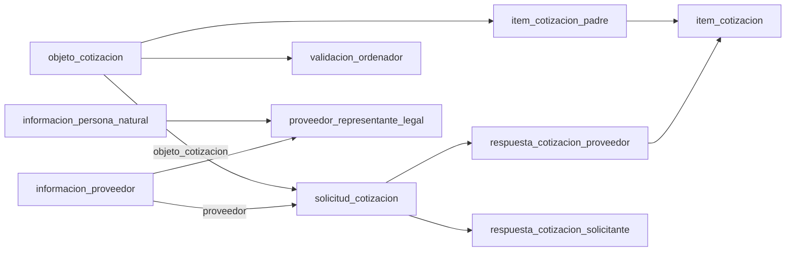

# Issue #18 — diagnóstico corregido de Agora y terceros

Fecha: 2026-09-27. Entorno: **pruebas**, confirmado por el responsable. Evidencia: capturas locales `AgoraFinal` y `Terceros`, contrastadas con [el análisis funcional de la issue #5](../issue-5/issue-5-roles-modulos-agora-v1.md). Se incorpora el perfilamiento ejecutado por el responsable en `AgoraCalidad` y `TercerosCalidad`. Los CSV, SQL y diagramas se conservan fuera de Git.

## Alcance vigente y evidencia productiva

El trabajo actual y el próximo sprint se limitan al registro de personas: contrato con terceros y estructura/API propia de Agora para las vistas revisadas. Toda identidad nueva se crea en terceros, incluso sin contrato; se reutiliza la existente cuando corresponda y Agora conserva su ID. Los jobs confirmados son de producción; su selección contractual histórica no condiciona las altas nuevas. Argo mantiene las vinculaciones de contratistas en terceros. La estructura de pruebas se considera una base aplicable a producción bajo la equivalencia habitual informada, con verificación puntual antes del despliegue; las cifras de datos no se extrapolan. Cotizaciones, respuestas, validaciones y otros módulos se abordarán después.

## Corrección del alcance anterior

El responsable confirmó que la primera captura correspondía a una base equivocada para este trabajo. Quedan sustituidas las conclusiones anteriores sobre 28 tablas `prov_*`, ausencia de tablas de negocio, falta de SELECT y predominio de logs. Tampoco se trasladan sus riesgos estructurales ni sus cifras al modelo actual. La evidencia vigente proviene de dos conexiones de **pruebas**, con acceso de lectura. No es una captura de producción.

`AgoraFinal` y `Terceros` son carpetas de evidencia, no nombres SQL de bases. La primera captura tiene esquema activo `agora`, la segunda `terceros`, en bases diferentes. Cada inventario incluye otros esquemas: se filtraron explícitamente `agora` y `terceros` para las cifras de este informe. Se omiten nombres de servidores, usuarios y bases ajenas al alcance.

## Inventario reproducible

Fuentes por carpeta: 1 contexto, 2 esquemas, 3 objetos/permisos/estimaciones, 4 columnas, 5 restricciones, 6 índices y 15 conteos de automatización. Esta captura estructural no contiene mediciones de calidad; las mediciones posteriores se documentan en la sección de calidad. El acceso de lectura se verifica en el resultado 3; la consulta 14 original filtra `public` y no verifica estos dos esquemas.

| Métrica del esquema seleccionado | agora | terceros |
|---|---:|---:|
| Tablas ordinarias | 46 | 13 |
| Secuencias | 33 | 13 |
| Columnas | 340 | 112 |
| PK | 45 | 13 |
| FK | 70 | 16 |
| UNIQUE adicionales | 5 | 0 |
| CHECK declarados | 14 | 0 |
| Índices | 71 | 13 |
| Tablas con SELECT | 46 | 13 |
| Tablas con RLS habilitado | 0 | 0 |
| Tablas con estimación de filas desconocida (-1) | 8 | 7 |
| Tamaño de tablas, índices y TOAST | 63,87 GiB | 245,52 MiB |

Las restricciones inventariadas figuran como validadas. No equivale a una auditoría de datos. `reltuples=-1` significa estimación desconocida, **no tabla vacía**. Las cifras de pruebas no permiten inferir volumen o calidad de producción.

`agora.objeto_cotizacion_forma_pago` es la única tabla del esquema sin PK; sus dos referencias permiten NULL. En terceros, todos los índices inventariados corresponden a PK: no hay unicidad declarada del par tipo+número de documento ni índices adicionales para las relaciones.

## Correspondencia con los flujos de la issue #5

La existencia y las FK de las tablas son evidencia estructural. Su correspondencia con pantallas/acciones es una hipótesis funcional fundamentada que debe contrastarse con catálogos, datos y recorridos del aplicativo.

| Función documental | Entidades observadas | Interpretación y validación pendiente |
|---|---|---|
| Registro y actualización natural (M1, pp. 8–17, 29–32) | informacion_persona_natural, informacion_proveedor | Datos de persona separados del registro/contacto bancario del proveedor. Determinar autoridad frente a terceros. |
| Registro jurídico y representante previamente inscrito (M1, pp. 18–26) | informacion_persona_juridica, proveedor_representante_legal | El representante referencia por FK el documento de una persona natural; el proveedor se referencia por ID. No hay FK directa del documento del proveedor a la tabla jurídica/natural. |
| Dirección/contacto (M1 y M2) | informacion_proveedor, telefono, proveedor_telefono, parametro_nomenclatura_dian | Dirección y correo en proveedor; teléfonos separados. Catálogos territoriales en core. |
| Actividades económicas (M1, pp. 33–35) | proveedor_actividad_ciiu, core.ciiu_subclase | Asociación proveedor–código; no hay FK declarada del código CIIU al catálogo. |
| Certificado (M1, pp. 36–37) | codigo_validacion | Candidato por nombre y campos; `id_tabla` no tiene FK y falta significado de tipo_certificacion. No afirmar que persiste el PDF. |
| Generación de solicitud (M5/M6) | objeto_cotizacion, item_cotizacion_padre, forma_pago, tablas objeto_cotizacion_* | Objeto central con vigencia, necesidad, responsables, fechas y condiciones; ítems base separados. |
| Envío/gestión por proveedor (M8, p. 50; M4) | solicitud_cotizacion | FK a objeto y proveedor; UNIQUE(objeto_cotizacion, proveedor). Interpretación: asignación/invitación por proveedor, no necesariamente cabecera de la solicitud de la interfaz. |
| Observaciones del proveedor (M4) | observacion_solicitud_cotizacion | FK a solicitud por proveedor; campo visto. No prueba entrega efectiva de notificaciones. |
| Respuesta/oferta (M4, pp. 20–35) | respuesta_cotizacion_proveedor, item_cotizacion | UNIQUE(solicitud_cotizacion) limita a una respuesta por solicitud no nula. Cada ítem ofertado referencia un ítem base y una respuesta. |
| Respuesta del solicitante (M8/M9) | respuesta_cotizacion_solicitante, resultado_cotizacion | Respuesta y resultado asociados a solicitud. Sin UNIQUE por solicitud: validar multiplicidad e historial. |
| Validación del ordenador (M7) | validacion_ordenador, objeto_cotizacion.estado_cotizacion | Entidad separada de la respuesta del solicitante, coherente con la distinción de la issue #5. La validación solo muestra ID, objeto y observaciones: no contiene fecha, actor ni decisión explícita. No inferir cómo se persiste aprobar/rechazar. |
| Modificaciones (M4/M8/M9) | solicitud_modificacion_cotizacion, relacion_estado_solicitud_modificacion, relacion_item_solicitud_modificacion, modificacion_item, modificacion_item_cotizacion, modificacion_respuesta_cotizacion_proveedor | Solicitud/estado y registros JSON anterior/nuevo. Confirmar reglas de edición, orden temporal y significado de base. |
| Acceso, recuperación, sesión y roles | No se identifica un modelo de cuentas/roles en el esquema agora seleccionado | No reutilizar el modelo de la base descartada sin confirmar relación con el despliegue. Personas naturales/jurídicas no equivalen a roles técnicos. |

El modelo contiene además evaluaciones, inhabilidades, sociedades/consorcios, supervisores e interventores. No están suficientemente descritos por los manuales resumidos en #5: requieren decisión de alcance, no deben eliminarse por falta de cobertura documental.

## Relaciones centrales

Las flechas van de entidad referenciada a entidad dependiente. Las restricciones no prueban transiciones ni autorización. El modelo no declara UNIQUE(respuesta_cotizacion_proveedor, item_cotizacion_padre_id); tampoco impone que el ítem base y la solicitud de la respuesta pertenezcan al mismo objeto. El perfilamiento 8a no encontró discordancias de objeto en esta captura; 8b sí encontró pares repetidos, cuya validez funcional debe evaluarse.

## Personas y terceros: riesgos concretos de conciliación

- `informacion_persona_natural` tiene PK únicamente sobre `num_documento_persona`, aunque almacena `tipo_documento`. El tipo referencia `parametro_estandar`, no el catálogo de terceros.
- `informacion_persona_juridica` tiene PK sobre NIT. `informacion_proveedor` usa ID propio y UNIQUE(num_documento, tipopersona); el tipo de persona admite NATURAL, JURIDICA, CONSORCIO, UNION TEMPORAL y EXTRANJERA. No reducir las cinco categorías a dos sin reglas.
- El documento de `informacion_proveedor` no tiene FK a persona natural/jurídica: deben contarse registros sin correspondencia, especialmente por categoría.
- En terceros, `tercero.id` identifica la entidad; `datos_identificacion` guarda tipo, número, dígito, fechas, activo y referencia a tercero. No hay UNIQUE(tipo_documento_id, numero), ni restricción que evite documentos activos repetidos. No demuestra duplicados: requiere consulta.
- Las cifras de terceros incluyen otras poblaciones universitarias. No comparar el total de terceros con el total de proveedores como si debieran coincidir.
- `tercero_tipo_tercero` permite clasificar al tercero, pero no prueba que el catálogo contenga un tipo proveedor. `vinculacion` puede representar relaciones; el significado de tipo_vinculacion_id requiere contrato/catálogo y no tiene FK declarada en esta tabla.
- `info_complementaria_tercero.dato` es JSONB y permite NULL; el catálogo de info_complementaria define grupo/tipo. No asignar allí contacto, banco o actividad económica por suposición. Hay relación padre–hijo que también debe preservar consistencia de propietario y ausencia de ciclos.
- La tabla específica `seguridad_social_tercero` relaciona dos terceros con fechas; puede ser destino de afiliaciones, sujeto a equivalencia de entidades. No usar automáticamente el viejo ID del catálogo como tercero_entidad_id.

## Dependencias externas y responsabilidades

Las FK de Agora referencian `core` (ciudad, país, banco, entidades, núcleo básico, jefes, ordenadores, medios de pago), `administrativa` (tipo de necesidad, plan de acción) y `kronos` (unidad ejecutora). Son dependencias comprobadas; no deben migrarse indiscriminadamente al dominio de personas.

`core.jefe_dependencia` contiene tercero_id sin FK declarada en esa tabla; no prueba equivalencia con terceros de la otra conexión. `objeto_cotizacion` también contiene campos como numero_necesidad y tipo_contrato sin FK que establezca toda su semántica externa. No asumir que un número sin vigencia/unidad sea clave completa.

**Están pendientes de confirmación las dependencias de la versión actual de Agora.** El contexto aportado atribuye información financiera a SICAPITAL, contratos a Argo y nómina a Titán, pero las capturas no prueban qué integraciones están activas ni sus contratos. Tras confirmar los jobs operativos, bancos y régimen se proponen en Agora según el [modelo inicial](issue-18-responsabilidades-y-modelo-inicial-crud.md); los datos de identidad transferidos pertenecen a terceros. La presencia de tablas de contratos/evaluación en Agora no sustituye el dominio de Argo; determinar si son referencias, evaluaciones propias o copia histórica.

Los conteos de la consulta 15 dan cero triggers no internos, herencia, servidores y tablas externas en ambas bases capturadas. En Agora no aparecen rutinas en el filtro; en la otra base hay 159 en public, con nombres de operaciones vectoriales, trigramas y UUID, compatibles con las extensiones inventariadas. No se identifica con ello un job de sincronización. El código de los jobs, frecuencia, dirección, watermark y conciliación siguen pendientes.

## Estimaciones de la captura estructural (anteriores al perfilamiento)

| Entidad | Filas estimadas |
|---|---:|
| informacion_persona_natural | 20.628 |
| informacion_persona_juridica | 5.173 |
| informacion_proveedor | 25.881 |
| objeto_cotizacion | 2.105 |
| solicitud_cotizacion | 760.332 |
| respuesta_cotizacion_proveedor | 4.833 |
| item_cotizacion_padre / item_cotizacion | 23.494 / 48.306 |
| respuesta_cotizacion_solicitante | 601.685 |
| tercero | 269.336 |
| datos_identificacion | 723.913 |
| info_complementaria_tercero | 890.581 |

La multiplicidad objeto–proveedor puede explicar parte de la diferencia entre objetos y solicitudes; no es evidencia automática de duplicación. `respuesta_cotizacion_solicitante` ocupa aproximadamente **63,73 GiB (99,78% del esquema agora)** con texto sin límite en respuesta. Esto obliga a descomponer heap/índices/TOAST y revisar estadísticas antes de exportar o estimar la PoC; no demuestra bloat ni corrupción.

Prioridades adicionales:

1. Fechas de registro/modificación del proveedor son texto. Medir formatos antes de convertir; no inventar fechas faltantes ni asumir zona por configuración de sesión.
2. `telefono.numero_tel` es numeric(10,0): no conserva ceros iniciales ni símbolos. El destino debería preservar el dato disponible como texto, sin reconstruir información perdida.
3. Revisar duplicados/nulos en objeto_cotizacion_forma_pago y porcentajes de pago. Confirmar si existen planes alternativos antes de exigir suma 100.
4. Verificar coherencia de respuesta/ítem con objeto, fechas de apertura/cierre y rangos de cantidad/valor. Catálogos y reglas determinan qué constituye error.
5. La referencia objeto_cotizacion.informacion_proveedor es numeric(6,0), mientras el ID de proveedor es numeric(10,0): verificar rango antes de evolucionar el modelo.
6. El origen incluye datos de salud, familiares, bancarios y otras categorías sensibles. Para diagnóstico compartir agregados; limitar el mapeo a atributos necesarios y manejar muestras desidentificadas fuera del repositorio.

## Perfilamiento recibido: resultados confirmados

Los siguientes resultados provienen de consultas ejecutadas por el responsable en pruebas, no de ejecuciones directas del asistente. Las capturas corresponden a momentos diferentes y no prueban un corte sincronizado entre bases. No interpretar las diferencias respecto de reltuples como altas o bajas: reltuples era una estimación.

### Agora

| Hallazgo | Resultado | Evidencia local y alcance |
|---|---|---|
| Personas naturales / jurídicas | 20.628 / 5.175 | AgoraCalidad/2, conteos exactos al ejecutar. |
| Proveedores | 25.890 | 20.634 naturales, 5.175 jurídicos y 81 extranjeros. No aparecen consorcios/uniones en la agrupación de esta captura. |
| Objetos / solicitudes por proveedor | 2.115 / 760.332 | Conteos exactos, distintas granularidades. |
| Respuestas de proveedor / ítems base / ítems ofertados | 4.823 / 23.505 / 48.306 | Conteos exactos. |
| Proveedor sin correspondencia exacta de documento | 6 naturales y 1 jurídico | AgoraCalidad/3. Es relación lógica sin FK. No se evaluó la correspondencia de extranjeros con esa consulta. |
| Documento vacío | 1 jurídico | No se puede afirmar que sea el mismo jurídico sin persona sin revisar el caso. |
| Contactos vacíos | 271 correos de naturales; 37 direcciones de naturales y 6 de jurídicos | Se midió vacío tras trim, no validez del correo ni suficiencia de dirección. |
| Documento repetido dentro del tipo de persona tras trim | 0 grupos | AgoraCalidad/4, excluye documentos vacíos; no prueba ausencia de duplicados de persona entre categorías. |
| CIIU sin correspondencia exacta en catálogo | 810 de 29.565 asociaciones | AgoraCalidad/10. Verificar códigos, versión de catálogo y equivalencias; no borrar automáticamente. |
| Forma de fechas textuales | Registro: 2 con forma de fecha y 25.888 con prefijo timestamp; modificación: 1 y 25.889 | AgoraCalidad/6. Los nombres de patrón indican que **no se validó el calendario**, no que esas 3 cadenas sean fechas inválidas. |

### Terceros

| Hallazgo | Resultado | Evidencia local y alcance |
|---|---|---|
| Grupos repetidos de tipo+número activo tras trim | 204.582 grupos; 415.536 filas participantes | TercerosCalidad/3. Filtra identificaciones activas no vacías, no el estado del tercero. |
| Grupos asociados a más de un tercero | 19.783 | Riesgo de conciliación ambigua. Son grupos de documentos, no 19.783 personas ni proveedores duplicados. |
| Grupos repetidos dentro de un solo tercero | 184.799 | Diferencia entre grupos repetidos y grupos con varios terceros; revisar repetición/historial sin fusionar identidades. |
| Complementos por forma | 486.582 objetos JSON y 404.161 SQL NULL | TercerosCalidad/6; total 890.743 filas. No aparecen otras formas en la exportación. |
| Complementos activos SQL NULL | 402.273 | Validar obligatoriedad y semántica de catálogo; no calificarlos todos como defectuosos. No se inspeccionó el contenido de los objetos. |
| Vinculaciones | 163.374; 8 con fecha de fin anterior al inicio | TercerosCalidad/7. Revisar los 8 casos y la semántica por tipo. |
| Tercero relacionado nulo en vinculaciones | 163.374 | El campo es opcional. La captura no aporta una relación poblada entre dos terceros que permita dar por implementada allí la representación legal. |
| Complementos autorreferentes / padre de otro tercero | 0 / 0 | TercerosCalidad/8. No descarta ciclos de mayor longitud ni otras incoherencias. |

## Exportaciones individuales verificadas

Se recibieron y revisaron las 18 exportaciones individuales pendientes: 9 de Agora y 9 de terceros. Cada fila tiene la cantidad de columnas de su propia cabecera. Los archivos combinados iniciales quedan sustituidos por estos resultados; no hace falta reexportarlos nuevamente. Los nombres locales usan 5a.csv, etc.; A/T identifica aquí la conexión.

| Evidencia individual | Resultado confirmado | Interpretación y límite |
|---|---|---|
| Agora 7a/7b | 3.664 asociaciones de pago, 0 referencias nulas y 0 pares repetidos | No valida porcentajes, condiciones de pago ni semántica funcional. |
| Agora 8a | 48.306 ítems; 0 referencias ausentes, respuestas sin solicitud, objetos discordantes y valores negativos en los controles ejecutados | No equivale a validar todas las reglas de una oferta. |
| Agora 8b | 19 pares respuesta–ítem base repetidos; 38 filas participantes | Ahora confirmado por cabeceras propias. No son 38 referencias ausentes. Verificar si son variantes permitidas o duplicación incorrecta antes de limpiar. |
| Agora 9a | 0 cierres anteriores a apertura; 959 objetos sin proveedor seleccionado | La ausencia de selección puede ser válida según estado; falta cruce por estado. |
| Agora 9b | 45 ítems base con cantidad menor o igual a cero | Confirmar regla y separar ceros/negativos antes de proponer transformación. |
| Terceros 2a | 269.375 terceros, 265.277 activos y 0 nombres vacíos | Nombre no vacío no prueba identidad correcta. |
| Terceros 2b | 723.947 identificaciones, 723.857 activas, 0 números vacíos y 7 números iguales a `0` tras trim | El control de `0` incluye activos e inactivos; no asumir que las siete identificaciones estén activas. |
| Terceros 4a/4b | 2.312 terceros activos sin identificación activa; 0 identificaciones sin tercero | La obligatoriedad de identificación depende de la categoría/uso; no dar de baja automáticamente. |

Las diferencias con la captura de estadísticas no prueban movimientos de datos. Las exportaciones separadas tampoco acreditan una instantánea coordinada entre ambas bases.

## Catálogos: evidencia disponible y equivalencias candidatas

Agora 5a contiene 43 parámetros; 5b, 8 estados de cotización; 5c, 3 resultados de respuesta: APROBADO, RECHAZADO y RECOTIZAR. Los estados del objeto y el resultado de la respuesta por proveedor son catálogos distintos. Su contenido no establece el orden de transiciones ni dónde se persiste la validación del ordenador.

Terceros 5a–5e contiene respectivamente 14 tipos de documento, 2 tipos de contribuyente, 16 tipos de tercero, 40 grupos y 286 definiciones de información complementaria. Los 2 tipos de contribuyente se denominan PERSONA NATURAL y PERSONA JURIDICA; esto no convierte régimen tributario en tipo de contribuyente ni resuelve categorías como consorcio, unión temporal o extranjera.

Comparación exacta de nombre y abreviatura: los 13 tipos de documento de Agora tienen un candidato único en terceros. Esta es una **hipótesis de homologación por catálogo**, pendiente de validar con el contrato; el job inspeccionado fija CC/NIT y no acredita que homologue los 13 tipos.

| Abreviatura | ID parámetro Agora | ID tipo_documento terceros |
|---|---:|---:|
| RC | 5 | 1 |
| TI | 6 | 2 |
| CC | 7 | 3 |
| CRSI | 8 | 4 |
| TE | 9 | 5 |
| CE | 10 | 6 |
| NIT | 11 | 7 |
| IEDD | 12 | 8 |
| PAS | 13 | 9 |
| DIE | 14 | 10 |
| SIED | 15 | 11 |
| DIEPJ | 16 | 12 |
| CD | 17 | 13 |

Terceros incorpora además CARNÉ ESTUDIANTE (CODE), sin equivalente en ese catálogo de Agora. No copiar IDs entre sistemas: por ejemplo, CC es 7 en el parámetro de Agora y 3 en terceros.

No aparece un tipo llamado PROVEEDOR en los 16 registros de tipo_tercero exportados. Esto no demuestra que terceros no soporte proveedores: su clasificación puede depender de otra relación, complemento o lógica del job. No crear un tipo nuevo antes de verificarlo.

En info_complementaria, 144 de las 286 definiciones tienen tipo_de_dato vacío. Existen complementos relacionados con contratación por nombre, pero no se inspeccionaron sus valores ni el contrato que los interpreta. Un nombre o la disponibilidad de JSON no basta para asignar un atributo de Agora a terceros. El job determinará qué se usa actualmente; cualquier extensión genérica debe justificarse por semántica y consumidores.

## Almacenamiento: evidencia adicional

AgoraCalidad/11 reporta 264.896.512 bytes de heap, 68.413.218.816 bytes de tabla incluyendo TOAST y auxiliares, 13.549.568 bytes de índices de la tabla y 68.426.768.384 bytes totales. La resta tabla-con-TOAST menos heap ronda 63,47 GiB: el peso se concentra fuera del heap principal, compatible con TOAST/estructuras auxiliares. La medición no atribuye ese espacio a una columna ni demuestra bloat.

last_analyze y last_autoanalyze aparecen vacíos; n_live_tup y n_dead_tup son 0 en esa vista, mientras reltuples conserva una estimación positiva. Estos contadores no son conteos exactos y no autorizan concluir que la tabla esté vacía ni libre de espacio recuperable. Falta medir el tamaño específico de TOAST y examinar una muestra controlada antes de elegir política de almacenamiento/migración.

## Límites y mitigación

**Mediciones de datos en pruebas.** Ninguna cifra o anomalía de este informe se atribuye a producción. La estructura analizada se utiliza como base aplicable a producción bajo la equivalencia habitual informada, respaldada por el mapeo de los jobs productivos. Para el sprint de registro corresponde verificar compatibilidad puntual antes del despliegue; la medición de calidad, volumen y conciliación productiva se realizará cuando se aborde la migración. No es requisito repetir el diagnóstico exhaustivo para diseñar el registro.

Se realizó perfilamiento parcial, no una auditoría completa. El asistente analizó CSV de consultas ejecutadas por el responsable; no modificó registros ni permisos. No se ha conciliado Agora con terceros, confirmado las dependencias/jobs del despliegue ni ejecutado la PoC.

La presentación de los resultados ya quedó corregida. Priorizar la revisión del job y la evaluación funcional de ambigüedades de identidad, CIIU sin catálogo, cobertura de personas/contactos y pares repetidos/cantidades no positivas en ítems. Registrar cada resolución y sus reglas antes de migrar. Todavía no se sabe qué debe migrarse. Revisar primero el job; evaluar conservar en terceros lo ya soportado, mantener en Agora lo específico y ampliar terceros solo cuando exista justificación de uso genérico. Los complementos existentes no determinan por sí solos esa decisión.

## Aclaraciones posteriores del responsable (2026-09-30)

El [registro de dependencias](issue-18-dependencias-y-alcance.md) complementa estas capturas: diferencia presencia física de esquemas de la responsabilidad futura de cada servicio. Arka queda fuera de las dependencias previstas; Core proporciona los códigos de actividad económica. Se confirmó acceso al paquete Talend local y se preparó una [revisión inicial de los flujos Agora–terceros](issue-18-jobs-agora-terceros.md). No se recibieron resultados de ejecución ni se realizó el diagnóstico de producción.
