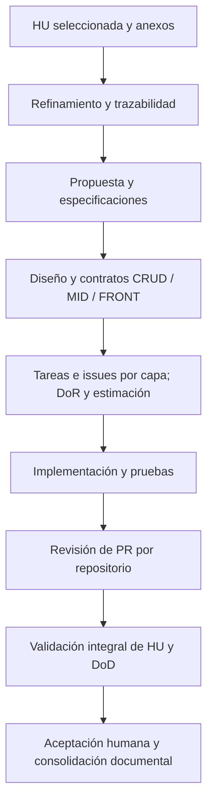

# OpenSpec y Kiro: comparación y proceso de especificación para Ágora

Fecha de consulta: 2026-09-16. Documento de análisis asociado al [issue #6](https://github.com/udistrital/agora_documentacion/issues/6).

Estado: propuesta de proceso para revisión del equipo. Este documento no acredita ejecución del piloto ni aprobación institucional.

## 1. Alcance y recomendación

Se recomienda evaluar OpenSpec con una tarea de desarrollo acotada y documentar los resultados en el issue #6. El caso de implementación se seleccionará por separado; no se presupone que el trabajo documental de este repositorio sea el piloto. Kiro puede evaluarse después con el mismo caso y las mismas condiciones.

El proceso propuesto adapta las reglas de Ágora encontradas en las skills locales de OATI. No constituye una política nueva para toda la Universidad Distrital ni reemplaza el refinamiento, la revisión técnica o la aceptación del equipo.

Como contexto institucional aportado por el equipo para esta comparación, la orientación es priorizar soluciones open source y evitar que la operación dependa de la compra de aplicaciones o accesos a un producto particular. Se incorpora como criterio de decisión comunicado para este trabajo; no se presenta como una prohibición formal de contratación ni como una norma documental verificada.

## 2. Comparación

Ambas herramientas apoyan el desarrollo dirigido por especificaciones: explicitar lo esperado, organizar el trabajo y contrastar la implementación con los requisitos. Su diferencia principal es cómo se integran al entorno de desarrollo.

| Aspecto | OpenSpec | Kiro |
|---|---|---|
| Naturaleza | Framework de especificación con CLI y orientación para un asistente compatible. | Producto de desarrollo con agente integrado y superficies IDE, CLI y web. |
| Quién redacta e implementa | El asistente elegido interpreta las fuentes y ejecuta el flujo. | El agente de Kiro genera los artefactos y ejecuta las tareas. |
| Artefactos principales | `proposal.md`, especificaciones del cambio, `design.md` y `tasks.md`. | Para funcionalidades: `requirements.md`, `design.md` y `tasks.md`. |
| Requisitos | Escenarios y cambios sobre especificaciones existentes. | Historias y criterios estructurados; Feature Specs utiliza notación EARS. |
| Adaptación al proyecto | Contexto y reglas por artefacto en `openspec/config.yaml`; esquemas personalizados si se necesitan. | Contexto del proyecto e instrucciones al agente; elegir el flujo de especificación apropiado. |
| Costos | Licencia MIT; el asistente/modelo utilizado puede generar costos separados. | Plan gratuito, suscripciones y beneficio estudiantil de un año para personas elegibles. |
| Encaje propuesto en Ágora | Mantener el asistente actual y añadir trazabilidad y artefactos versionados. | Evaluar una experiencia integrada usando los mismos criterios de aceptación institucionales. |

Fuentes: [OpenSpec](https://github.com/Fission-AI/OpenSpec), [configuración de OpenSpec](https://github.com/Fission-AI/OpenSpec/blob/main/docs/customization.md), [Specs de Kiro](https://kiro.dev/docs/specs/) y [Feature Specs](https://kiro.dev/docs/specs/feature-specs/).

### Costos consultados

| Plan Kiro | USD por usuario/mes | Créditos mensuales |
|---|---:|---:|
| Free | 0 | 50 |
| Pro | 20 | 1.000 |
| Pro+ | 40 | 2.000 |
| Pro Max | 100 | 5.000 |
| Power | 200 | 10.000 |

Valores antes de impuestos. Los créditos no equivalen a tareas: su consumo depende de la operación y del modelo. Para comparar costos, registrar el consumo real del mismo piloto en cada alternativa, incluyendo el costo del asistente que ejecute OpenSpec. Estas tarifas pueden cambiar. [Precios oficiales de Kiro](https://kiro.dev/pricing/).

### Beneficio estudiantil de Kiro

La oferta oficial entrega **1.000 créditos mensuales gratuitos durante un año** a estudiantes elegibles. La **Universidad Distrital Francisco José de Caldas aparece en la lista de instituciones participantes**. Se requiere correo universitario asociado a la cuenta, tener al menos 18 años y verificar la condición de estudiante mediante SheerID; no se exige tarjeta de crédito. Por tanto, existe una oferta aplicable a estudiantes de la Universidad, pero no es una asignación automática a todos los estudiantes. [Programa Kiro Students](https://kiro.dev/students/).

Los créditos no se acumulan y al terminar el año la cuenta pasa al plan gratuito. Esto representa una ventaja temporal para formación y pilotos de estudiantes elegibles; no garantiza capacidad equivalente permanente para la operación institucional. [Condiciones operativas del programa](https://kiro.dev/students/).

### Autonomía tecnológica y sostenibilidad

Considerando la orientación open source indicada por el equipo, se mantiene OpenSpec como primera alternativa para el piloto: su licencia MIT y la posibilidad de utilizar distintos asistentes favorecen la adaptación del flujo y la sustitución de componentes. Esto no significa que toda la cadena sea abierta o gratuita: debe evaluarse también la licencia, el costo y la dependencia del asistente y del modelo elegidos. [Licencia e integraciones de OpenSpec](https://github.com/Fission-AI/OpenSpec).

Kiro sigue siendo una alternativa válida de experimentación por su beneficio estudiantil. La decisión de adoptarlo de forma sostenida debe ponderar la continuidad después de la promoción y la capacidad de trabajar con otras herramientas. Como criterio propuesto para ambos pilotos, conservar HU, especificaciones, tareas y evidencia en los repositorios institucionales, y comprobar que otro asistente pueda continuar el trabajo a partir de esos artefactos.

La evaluación distinguirá **ventaja económica temporal** de **adecuación institucional a largo plazo**: aprovechar una oferta educativa puede facilitar el aprendizaje, mientras que el proceso operativo debe poder continuar sin depender de ese beneficio ni de una suscripción específica.

## 3. Fuentes de verdad y responsabilidades

Según las reglas locales de Ágora, la **HU es la fuente funcional de verdad** y la **issue es una unidad técnica de un repositorio**. La especificación generada debe conservar esta relación.

| Fuente | Qué aporta | Tratamiento propuesto |
|---|---|---|
| HU y anexos funcionales | Necesidad, actores, reglas y criterios de aceptación. | Conservar ID, versión y enlace; si está en un workbook, registrar archivo/origen, hoja, ID y fila. |
| Issue y comentarios pertinentes | Responsabilidad técnica, subtareas, decisiones, DoR y DoD. | Resolver su HU de origen y las issues relacionadas. No inferir la HU por coincidencia numérica. |
| Código, contratos y especificaciones existentes | Comportamiento implementado y restricciones técnicas. | Registrar repositorio, ruta y SHA. Una implementación existente puede contener defectos; no redefine por sí sola la necesidad funcional. |
| Lineamientos y skills aplicables | Convenciones, controles y criterios de revisión. | Registrar versión y alcance; consultar las fuentes institucionales pertinentes al stack. |
| Sugerencias del agente | Posibles soluciones y escenarios adicionales. | Identificar como PROPUESTOS hasta validación; no presentarlos como criterios originales. |

Si las fuentes se contradicen, registrar el conflicto y la decisión pendiente. Si no hay HU porque el trabajo es documental o técnico independiente, conservar el issue como fuente explícita y aclarar esa excepción con el equipo, sin fabricar una historia.

El agente necesita acceso efectivo a las fuentes. Proporcionar un enlace a GitHub no garantiza que lo haya leído: debe recuperar el contenido mediante las herramientas disponibles o recibir una exportación con URL, versión y fecha.

## 4. Cómo se genera `proposal.md`

Normalmente el asistente lo redacta usando el flujo de OpenSpec; el desarrollador no necesita crearlo manualmente. La herramienta aporta estructura e instrucciones, mientras el agente interpreta el contexto suministrado.

El flujo `propose` genera los artefactos de planificación. En el flujo ampliado, `new` crea la estructura y `continue` o `ff` genera los artefactos. Los comandos `openspec ...` se ejecutan en terminal; las acciones `/opsx:...` corresponden al chat del asistente y su sintaxis concreta depende de la integración. [Guía de inicio](https://github.com/Fission-AI/OpenSpec/blob/main/docs/getting-started.md).

Para Ágora se propone aportar al generador este paquete mínimo:

- HU completa y criterios originales, con localizador y versión.
- Issue técnica seleccionada y contexto de las capas involucradas.
- Repositorios y revisiones de referencia; contratos existentes relevantes.
- Reglas institucionales aplicables y brechas conocidas.
- Alcance acordado del cambio, exclusiones y evidencia esperada.

La propuesta debe explicar el problema, el resultado buscado, alcance e impacto y enlazar las fuentes. Las especificaciones detallan comportamientos comprobables; el diseño describe cómo realizarlos; las tareas organizan su implementación. No basta con copiar el texto de la issue a todos los archivos.

## 5. Proceso propuesto para Universidad Distrital / Ágora



### Paso 1. Seleccionar y recuperar el contexto

Seleccionar explícitamente una HU o un conjunto acotado. El planner admite IDs o rangos definidos del workbook; no procesa todas las filas por omisión. Su configuración de Excel es provisional: no asumir nombres definitivos de columnas.

Leer la HU completa y sus anexos. Identificar los repositorios CRUD, MID y FRONT realmente involucrados, distinguiendo capa sin cambios de capa pendiente o inaccesible. Si ya hay issues, recuperar sus vínculos antes de proponer otras.

### Paso 2. Refinar la necesidad y comprobar el DoR

Definir actores, condiciones, resultados observables y dependencias. Preservar los criterios originales; cuando no tengan identificadores, asignar claves locales como `AC-1` sin alterar su contenido.

Evaluar cada elemento del DoR con evidencia. Las plantillas locales contienen casillas premarcadas: no demuestran que el equipo haya refinado o estimado el trabajo. Usar los estados de las skills `READY`, `READY_WITH_GAPS` o `NOT_READY`; una dependencia bloqueante o criterios esenciales ausentes impiden considerar lista la unidad.

### Paso 3. Generar y revisar propuesta y especificaciones

Crear el cambio a partir del paquete de fuentes. Para cada requisito, conservar la relación con el criterio HU y redactar escenarios verificables. Añadir casos de error, permisos y límites cuando estén sustentados; cualquier ampliación funcional requiere identificación como propuesta.

En Kiro se recomienda **Requirements-First** para este recorrido desde HU: requisitos, diseño y tareas. Es una elección para el piloto, no la única modalidad del producto. [Flujos de Feature Specs](https://kiro.dev/docs/specs/feature-specs/).

El equipo revisa que el comportamiento propuesto corresponda a la HU. La generación automática de documentos no acredita esta revisión.

### Paso 4. Diseñar la solución entre repositorios

Asignar responsabilidades según la arquitectura efectiva:

| Capa | Responsabilidad de referencia en las skills |
|---|---|
| CRUD | Persistencia, esquema, restricciones, migraciones y contrato de datos. |
| MID | Reglas de negocio, orquestación, integraciones y contrato consumido por FRONT. |
| FRONT | Interacción, escenarios de usuario, estados de carga/error y consumo de servicios. |

Documentar contratos de ambos extremos: método, ruta, parámetros, payload, tipos, respuestas, errores y permisos. No inventar endpoints o servicios ausentes. Si el FRONT usa Single-SPA, considerar su integración con el shell institucional.

Para el piloto se propone mantener una referencia funcional común y tareas separadas por repositorio. Si cada repositorio tiene artefactos propios, enlazarlos con el mismo ID HU y la misma versión de requisitos. La ubicación autoritativa debe quedar explícita para evitar copias divergentes. Esto es una propuesta organizativa, no sincronización automática entre herramientas.

### Paso 5. Planificar tareas e issues con las reglas Ágora

Usar `agora-backlog-planner` para preparar borradores. La versión inspeccionada permite como máximo una issue propuesta por capa presente de cada HU. Las tareas de `tasks.md` son pasos dentro de esa responsabilidad: no deben convertirse automáticamente en una issue por checkbox.

Seleccionar la plantilla según la naturaleza del entregable:

- **Analyst:** análisis, diseño o documentación sin implementación productiva.
- **Developer:** implementación acotada sin necesidades adicionales de especificación.
- **Developer Plus:** cuando el cambio requiere contratos, migraciones, integración institucional, decisiones arquitectónicas, seguridad o pruebas detalladas.

Conservar las secciones de la plantilla aplicable. Proponer PH únicamente en la escala `1, 2, 3, 5, 8, 13`, con máximo 13 por issue. Si supera ese tamaño, volver a refinamiento; no truncar la estimación ni emitir varias issues de la misma capa para eludir la regla. La estimación del agente no equivale al acuerdo del equipo.

Resolver Sprint semanal y campos reales del Project antes de proponer asignaciones. `Developed` permanece de solo lectura y no demuestra aceptación. Estas reglas provienen del contrato Ágora de las skills; no se atribuyen como norma general de toda la Universidad.

### Paso 6. Implementar y obtener evidencia

Con alcance y dependencias resueltos, ejecutar las tareas en el repositorio de código correspondiente. Seguir la estrategia de ramas aplicable y conservar el vínculo HU → issue → cambio → PR.

Aplicar las skills técnicas pertinentes. Por ejemplo, `peticion-http` prescribe el uso de `utils_oas` para peticiones salientes en APIs Go y la preservación de contratos; su uso exige revisar su alcance y versiones concretas antes de ejecutar una migración. No aplicar una migración Go a un piloto que no involucre ese stack.

Ejecutar las pruebas correspondientes a los escenarios y registrar resultados. Validar el formato de una especificación y marcar tareas completas son comprobaciones diferentes de demostrar funcionamiento.

### Paso 7. Revisar PR y aceptar la HU por separado

Usar `agora-pr-reviewer` para revisar responsabilidad local, contratos, evidencia y SHA del PR. Su recomendación `APPROVE` puede coexistir con una HU parcialmente implementada si otras capas siguen pendientes.

Usar `agora-story-validator` para reconstruir la aceptación integral: criterios funcionales, contratos entre capas, evidencia de la versión objetivo y DoD por issue. Un mock prueba una parte; no acredita integración con servicios reales. PRs fusionados tampoco demuestran por sí solos aceptación funcional.

La aceptación requiere resultados sustentados y las aprobaciones humanas aplicables. Si todo está implementado pero falta evidencia funcional, el estado es `IMPLEMENTED_PENDING_VALIDATION`; no `COMPLETE`.

### Paso 8. Consolidar y documentar

Actualizar los artefactos cuando cambie el alcance acordado, conservando la decisión y su fuente. Consolidar las especificaciones del cambio terminado y documentar qué evidencia satisface cada criterio. Archivar un cambio en la herramienta no equivale a cerrar la HU ni a autorizar un despliegue.

Las tres skills de planificación/revisión/validación inspeccionadas generan borradores o informes locales. No publican issues, reviews ni cambios de Project, ni realizan merge. Esa limitación describe sus versiones actuales; no es una limitación universal de OpenSpec o Kiro.

## 6. Trazabilidad mínima propuesta

| HU / versión | Criterio original | Requisito / escenario | Repo / issue / tarea | PR / SHA | Prueba / ambiente / fecha | Resultado |
|---|---|---|---|---|---|---|
| Por completar con una HU real | AC-1 | REQ-1 / escenario identificado | Referencias verificadas | Revisión efectiva | Evidencia enlazada | PASS / FAIL / UNVERIFIED / N/A |

Conservar además una matriz DoD por issue. `UNVERIFIED` significa evidencia insuficiente; `FAIL` exige un resultado incompatible observado. Justificar siempre `N/A`.

## 7. Instrucción reutilizable para generar las specs

```text
Objetivo: preparar las especificaciones de un cambio Ágora.

Entradas:
- HU: <ID, URL o workbook/hoja/ID/fila y versión>.
- Issue: <URL verificada, si existe>.
- Repositorios y revisiones: <CRUD/MID/FRONT aplicables>.
- Anexos, contratos y lineamientos: <fuentes accesibles>.
- Alcance seleccionado: <resultado acotado del piloto>.

Lee las fuentes completas. Trata la HU como fuente funcional y la issue
como responsabilidad técnica. Informa fuentes inaccesibles y conflictos.
Conserva los criterios originales y etiqueta los adicionales como PROPUESTOS.

Genera la propuesta, requisitos con escenarios, diseño y tareas usando el
flujo de la herramienta. Mantén trazabilidad por criterio y repositorio,
contratos, dependencias, pruebas esperadas y brechas DoR.
Respeta las reglas Ágora de planificación; no inventes repositorios,
issues, estimaciones acordadas ni aprobaciones.

Entrega los artefactos para revisión. En esta etapa solo se solicita
planificación: no implementar tareas ni publicar cambios en GitHub.
```

## 8. Evidencia pendiente para el issue #6

Este documento cubre comparación y propuesta metodológica. Para acreditar el piloto faltan: selección del caso real, versiones de herramienta/agente/skills, fuentes de entrada, artefactos generados, decisiones humanas, implementación, pruebas y resultados.

Registrar tiempo, consumo/costo si está disponible, correcciones requeridas y cobertura de criterios. Si se compara Kiro, usar el mismo alcance y revisiones iniciales, identificando cualquier diferencia de modelo o entorno. No declarar una herramienta superior basándose únicamente en que genera más documentos.

## 9. Fuentes locales y límites de la revisión

Skills consultadas en `/home/camilo/projects/OATI/skills-desarrollo/skills` (HEAD del repositorio al consultar: `7986c533246d48d0c82f022be5b855f8d1a5260b`; se leyó el contenido del árbol de trabajo):

- `agora-backlog-planner/SKILL.md` y referencias `agora-rules.md`, `input-contract.md`, `planning.md`, `institutional-sources.md`: origen funcional, capas, PH, DoR y borradores.
- `agora-pr-reviewer/SKILL.md`: revisión técnica y separación entre resultado del PR y avance HU.
- `agora-story-validator/SKILL.md` y `references/acceptance.md`: aceptación por criterio, evidencia integral y DoD.
- `peticion-http/SKILL.md`, secciones de objetivo y reglas: ejemplo de restricciones técnicas específicas; no se ejecutó la skill de migración.

Las rutas de skills son referencias locales al entorno consultado; no están incluidas en este repositorio. Para reproducir el piloto, proporcionar al equipo la revisión utilizada y acceso a esos archivos.

Plantillas leídas en este checkout (HEAD: `7151d6755b21aafe3e72e53ed96a8bdc39fc7767`): [Analyst](../../.github/ISSUE_TEMPLATE/template-for-analyst-.md), [Developer](../../.github/ISSUE_TEMPLATE/template-for-developer-.md) y [Developer Plus](../../.github/ISSUE_TEMPLATE/template-for-developer-plus.md).

El catálogo institucional de las skills registra una auditoría del 2026-09-11 de [lineamientos_oas](https://github.com/udistrital/lineamientos_oas). La consulta web directa a la guía de ramas y a la plantilla remota Developer no devolvió contenido en esta revisión; por ello, aquí se usa la evidencia local y no se certifica su vigencia remota. Antes del piloto se deben recuperar las versiones aplicables al repositorio y stack seleccionados.

La documentación oficial de OpenSpec y Kiro se consultó en línea el 2026-09-16 y se enlaza junto a las afirmaciones correspondientes. No se instalaron herramientas ni se ejecutaron pilotos para elaborar esta comparación.
